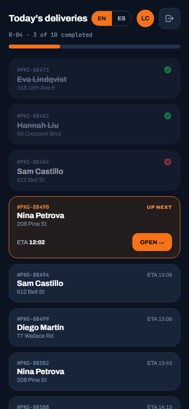
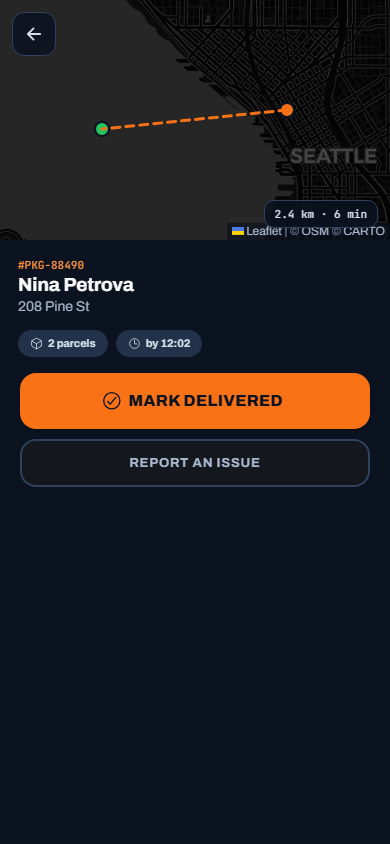
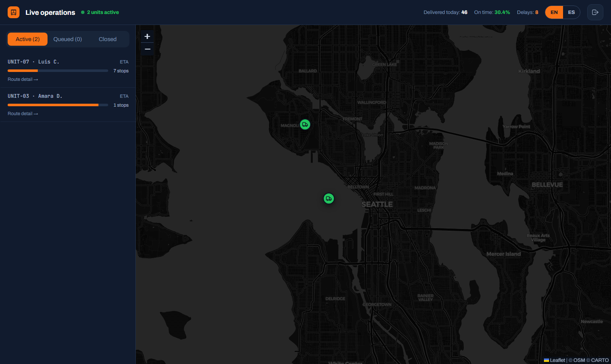

# FleetGo — Last-mile logistics & live fleet tracking

A logistics platform built as a portfolio flagship: couriers work their daily route from a **mobile driver app** (delivery list, signature capture, incident reporting) while coordinators watch the whole fleet move **live on a dispatch map**. One Ionic app, two role-based experiences — positions stream over SignalR and a server-side **fleet simulator** keeps the demo alive without real drivers.

**Live demo:** https://luisgxz.github.io/FleetGo/ · **API:** Azure App Service (free tier — first request after idle may take ~30–60 s)

| | |
|---|---|
|  |  |



## Demo accounts

| Role | Email | Password |
|---|---|---|
| Courier (driver app) | `courier@fleetgo.dev` | `Demo1234!` |
| Coordinator (dispatch) | `dispatch@fleetgo.dev` | `Demo1234!` |

Open both at once: deliver a package with a signature as the courier and watch the dispatch unit row and KPIs update live.

## Stack

- **Backend:** .NET 9 Web API · Clean Architecture (Domain / Application / Infrastructure / Api) · EF Core 9 · SQL Server · SignalR
- **Frontend:** Ionic 8 + Angular 20 (standalone, signals, lazy routes) · Leaflet with CARTO dark tiles · hand-written bilingual EN/ES copy system · installable PWA
- **Auth:** JWT (15 min) + rotating refresh tokens + account lockout · roles `Courier` / `Coordinator` enforced in the service layer
- **Real-time:** SignalR hub (`UnitMoved`, `DeliveryUpdated`) · in-memory `IPositionStore` (Redis-ready seam) · fleet simulator `BackgroundService`
- **Tests:** 20 xUnit tests (delivery transitions, signature rules, route progress, haversine, RBAC, position store) + 5 Playwright E2E flows
- **Delivery:** GitHub Actions CI · frontend on GitHub Pages · API + DB on Azure (App Service F1 + Azure SQL serverless)

## Highlights

- **One app, two experiences.** `/driver` is a dark, thumb-sized mobile UI (44 px+ touch targets); `/dispatch` is a desktop panel with a live Leaflet map. They share auth, i18n, API client and the SignalR core. In production these would ship as separate apps — a single deploy demonstrates both Ionic and a web panel from one codebase.
- **Domain rules are server-side and unrepresentable to break:** a courier gets **403** on any route that isn't theirs; `Delivered` requires a signature PNG when `SignatureRequired`; closed deliveries are **immutable**; every transition appends a `DeliveryEvent` with position (who, when, where) — never updated, never deleted.
- **Positions never touch SQL.** Pings (~5 s) go to an in-memory store and broadcast straight to the hub. The `IPositionStore` interface is the seam where a `RedisPositionStore` would plug in for multi-instance deployments — documented trade-off, not an accident.
- **Fleet simulator:** a `BackgroundService` interpolates every active unit toward its next stop each ~3 s, resolves stops on arrival (93 % delivered / 7 % failed) and broadcasts — except `UNIT-07`, reserved for the interactive demo courier.
- **Signature pad is a hand-rolled canvas** (pointer events → PNG data URL, devicePixelRatio-aware) — no extra libraries.

## Run locally

Requirements: .NET 9 SDK, Node 20+, SQL Server (local, Windows auth).

```bash
# API — migrates and seeds the demo fleet automatically in Development (http://localhost:5200)
dotnet run --project backend/FleetGo.Api --urls http://localhost:5200

# App (http://localhost:4200)
cd frontend && npm install && npm start
```

```bash
dotnet test backend/FleetGo.sln          # 20 unit/integration tests
cd frontend && npm run e2e               # 5 Playwright flows (starts both servers)
```

## Documentation

- [`docs/TECHNICAL.md`](docs/TECHNICAL.md) — architecture deep-dive for technical interviewers
- [`/about`](https://luisgxz.github.io/FleetGo/about) — the same summary inside the app, bilingual, no login needed
